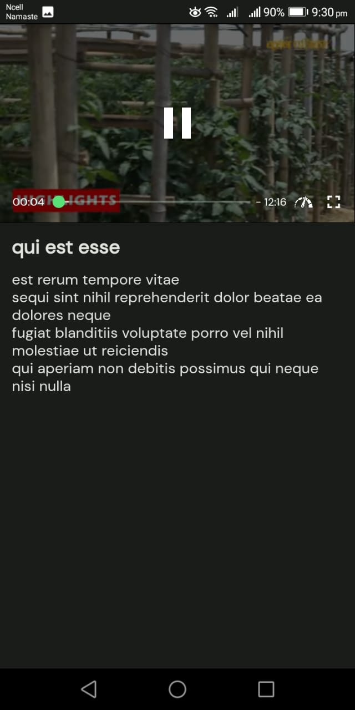

# Krishi

This is a Flutter application that provides the following features:

## Screenshots

## Features

- Dark and Light Mode: This Flutter app supports both dark and light modes for a personalized user experience.

- Playing Video from YouTube: Users can watch YouTube videos directly within the app.

- Internet Connection Check: The app checks for an internet connection to ensure seamless functionality.

- Refresh: Users can refresh content to get the latest updates.

- Search: The app includes a search feature to help users find specific content easily.

- Fetching Data from JSON Placeholder: This Flutter app fetches data from JSON Placeholder for dynamic content.

## Installation

To install this Flutter application, download the APK file from the following path:

[Download APK](https://github.com/sanam-tamang/krishi/apk_file/app-release.apk)

Once downloaded, you can install the app on your Android device.

## Usage

To use this Flutter app, simply install it on your Android device using the APK file provided.

